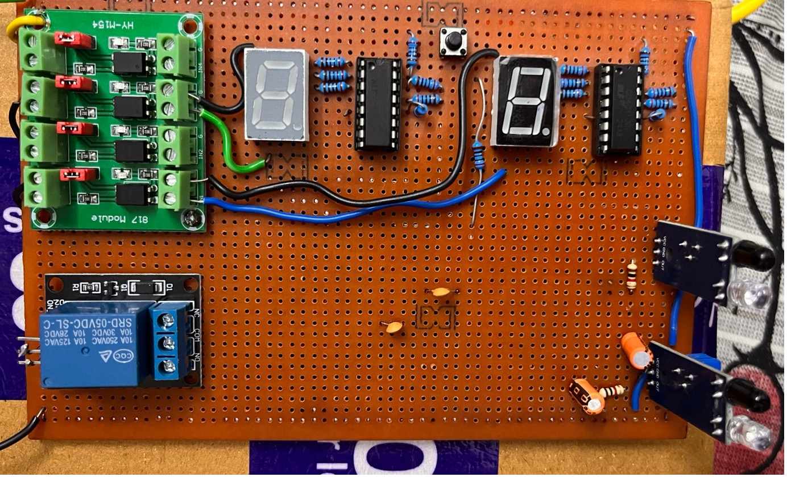

# Automatic Power Saving System Using Bidirectional IRs

An automatic room power-saving system built using pure hardware (ICs only). Bidirectional IR sensors detect the entry and exit of people, a counter IC tracks room occupancy, and electrical loads are controlled automatically — lights turn ON when someone enters and OFF when the room is empty.

---

## How It Works

1. Two IR sensors are placed at the door — one for entry, one for exit
2. The sensor sequence determines direction (entry vs exit)
3. A counter IC increments or decrements based on direction
4. When occupancy count > 0, lights are ON
5. When count reaches 0, lights turn OFF automatically

---

## Components Used

| Component | Purpose |
|---|---|
| IR Transmitter & Receiver (x2) | Detect entry and exit at the door |
| Counter IC (CD40110) | Tracks room occupancy count |
| Logic Gates | Direction detection and control logic |
| Relay Module | Switches electrical load (lights) |
| Power Supply | Regulated DC supply for the circuit |

---

## Project Files

| File | Description |
|---|---|
| `Sate Flow Diagram.png` | State flow of the control logic |
| `Proteus Implementation.png` | Simulation in Proteus |
| `Prototype.jpg` | Physical hardware prototype |
| `Testing Result.jpg` | Output observed during testing |
| `Project Report.pdf` | Detailed project documentation |

---

## Proteus Simulation

---

## State Flow

---

## Prototype

---

## Testing Result

---

## Key Learnings

- Bidirectional IR sensor interfacing for direction detection
- Counter IC-based occupancy tracking without a microcontroller
- Relay-based load switching using logic-level signals
- Hardware debugging and Proteus simulation for validation

---

